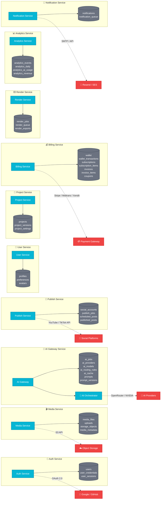
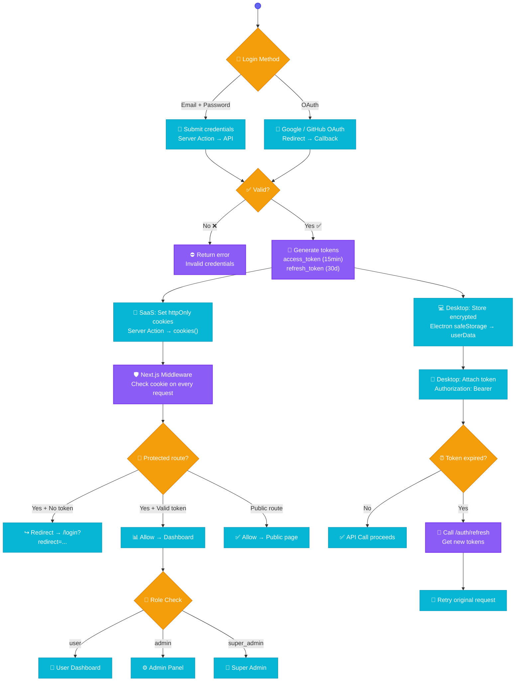
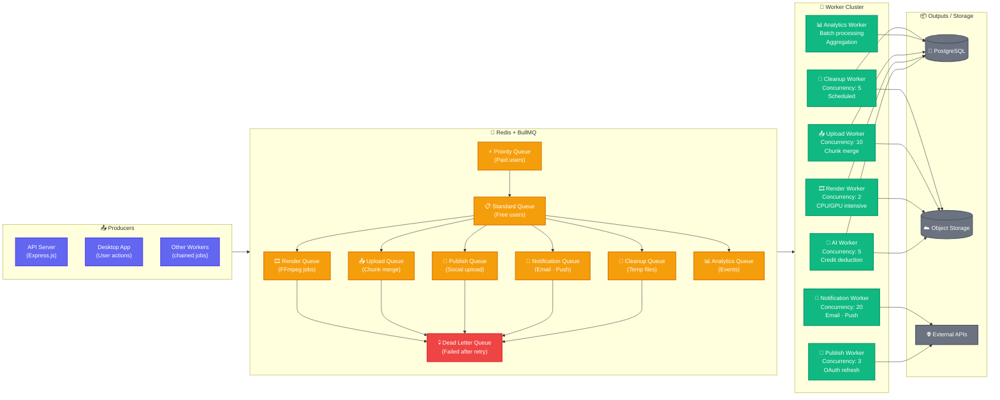
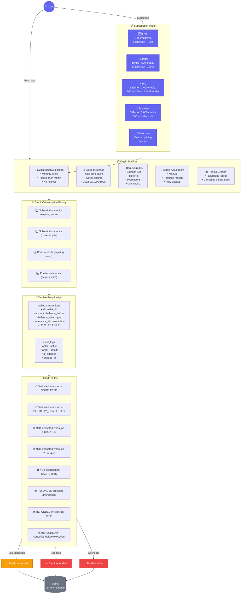

# 🏗️ Architecture Diagrams — AI Video Clipper Platform

**Version:** 1.0.0  
**Reference:** PRD v1.0, SRS v1.0, System Architecture v1.0

> Diagram visual interaktif menggunakan **Mermaid.js**.  
> Render otomatis di GitHub, GitLab, atau editor yang mendukung Mermaid.  
> Buka file ini di [Mermaid Live Editor](https://mermaid.live) untuk ekspor PNG/SVG.

---

## 📋 Daftar Diagram

| # | Diagram | Halaman |
|---|---------|---------|
| 1 | [High-Level System Architecture](#1-high-level-system-architecture) | Arsitektur sistem keseluruhan |
| 2 | [Component Architecture (Service Map)](#2-component-architecture-service-map) | Dekomposisi services |
| 3 | [AI Pipeline Flow](#3-ai-pipeline-flow) | 14-stage pipeline AI |
| 4 | [Data Flow: Upload + AI Processing](#4-data-flow-upload--ai-processing) | Alur upload & proses AI |
| 5 | [Authentication & Authorization Flow](#5-authentication--authorization-flow) | Alur auth SaaS + Desktop |
| 6 | [Electron Desktop Architecture](#6-electron-desktop-architecture) | Arsitektur proses & IPC |
| 7 | [Queue & Worker Architecture](#7-queue--worker-architecture) | Redis + BullMQ topology |
| 8 | [Billing & Credit System](#8-billing--credit-system) | Alur monetisasi |
| 9 | [Deployment & CI/CD Architecture](#9-deployment--cicd-architecture) | Pipelines & blue-green |
| 10 | [Database Entity Relationships](#10-database-entity-relationships) | ERD ringkas antar domain |

---

## 1. High-Level System Architecture

```mermaid
graph TB
    %% ── STYLE DEFINITIONS ──
    classDef client fill:#6366f1,color:#fff,stroke:#4f46e5,stroke-width:2px
    classDef gateway fill:#8b5cf6,color:#fff,stroke:#7c3aed,stroke-width:2px
    classDef service fill:#06b6d4,color:#fff,stroke:#0891b2,stroke-width:2px
    classDef orchestrator fill:#f59e0b,color:#fff,stroke:#d97706,stroke-width:2px
    classDef queue fill:#10b981,color:#fff,stroke:#059669,stroke-width:2px
    classDef worker fill:#34d399,color:#fff,stroke:#10b981,stroke-width:2px
    classDef data fill:#6b7280,color:#fff,stroke:#4b5563,stroke-width:2px
    classDef external fill:#ef4444,color:#fff,stroke:#dc2626,stroke-width:2px
    classDef ai fill:#ec4899,color:#fff,stroke:#db2777,stroke-width:2px

    %% ── CLIENT LAYER ──
    subgraph CLIENT [📱 Client Layer]
        DESKTOP["Desktop App<br/>(Electron + React + TS)<br/>• Editor · Renderer · FFmpeg"]
        WEB["Web SaaS<br/>(Next.js + React + TS)<br/>• Dashboard · Billing · Analytics"]
    end

    %% ── API GATEWAY ──
    subgraph GATEWAY [🚪 API Gateway Layer]
        NGINX["Nginx Reverse Proxy<br/>• TLS 1.3 · Rate Limiting<br/>• Load Balancing · CORS"]
        EXPRESS["Express.js API Server<br/>• JWT Auth · Validation<br/>• WebSocket Gateway"]
    end

    %% ── SERVICE LAYER ──
    subgraph SVCLAYER [⚙️ Service Layer]
        AUTH["🔐 Auth Service"]
        USER["👤 User Service"]
        PROJ["📁 Project Service"]
        MEDIA["🎬 Media Service"]
        TIMELINE["⏱️ Timeline Service"]
        
        subgraph AIBLOCK [🤖 AI Block]
            AI_GATEWAY["🔌 AI Gateway Service"]
            ORCHESTRATOR["🧠 AI Orchestrator<br/>• Router · Prompt · Credit<br/>• Cache · Fallback"]
        end

        RENDER["🎞️ Render Service"]
        PUBLISH["📢 Publish Service"]
        BILLING["💰 Billing Service"]
        ANALYTICS["📊 Analytics Service"]
        NOTIF["🔔 Notification Service"]
    end

    %% ── QUEUE & WORKER ──
    subgraph QWORKER [📨 Queue & Worker Layer]
        REDIS["Redis + BullMQ<br/>• 8 Queues · DLQ<br/>• Priority · Scheduling"]
        WORKERS["Worker Cluster<br/>• AI · Render · Upload · Publish · Notif · Cleanup"]
    end

    %% ── DATA LAYER ──
    subgraph DATA [💾 Data Layer]
        PG[("PostgreSQL 15<br/>(via Prisma)")]
        REDIS_CACHE[("Redis Cache<br/>(Session · AI Cache)")]
        STORAGE[("Object Storage<br/>• Supabase Storage<br/>• Cloudflare R2")]
    end

    %% ── EXTERNAL SERVICES ──
    subgraph EXTERNAL [🌐 External Services]
        AI_PROVIDERS["🤖 AI Providers<br/>OpenRouter · NVIDIA · OpenCode"]
        PAYMENT["💳 Payment Gateway<br/>Stripe · Midtrans · Xendit"]
        EMAIL["📧 Email Service<br/>Resend · SES"]
        OAUTH["🔑 OAuth Providers<br/>Google · GitHub"]
        SOCIAL["📱 Social Platforms<br/>YouTube · TikTok"]
    end

    %% ── CONNECTIONS ──
    DESKTOP -->|"HTTPS / WSS"| NGINX
    WEB -->|"HTTPS / WSS"| NGINX
    NGINX --> EXPRESS

    EXPRESS --> AUTH
    EXPRESS --> USER
    EXPRESS --> PROJ
    EXPRESS --> MEDIA
    EXPRESS --> TIMELINE
    EXPRESS --> AI_GATEWAY
    EXPRESS --> RENDER
    EXPRESS --> PUBLISH
    EXPRESS --> BILLING
    EXPRESS --> ANALYTICS
    EXPRESS --> NOTIF

    AI_GATEWAY --> ORCHESTRATOR
    
    AUTH --> PG
    USER --> PG
    PROJ --> PG
    MEDIA --> PG
    TIMELINE --> PG
    AI_GATEWAY --> PG
    RENDER --> PG
    PUBLISH --> PG
    BILLING --> PG
    ANALYTICS --> PG
    NOTIF --> PG

    EXPRESS --> REDIS
    REDIS --> WORKERS
    WORKERS --> ORCHESTRATOR
    WORKERS --> PG
    WORKERS --> STORAGE

    AUTH --> OAUTH
    ORCHESTRATOR --> AI_PROVIDERS
    BILLING --> PAYMENT
    NOTIF --> EMAIL
    PUBLISH --> SOCIAL

    DESKTOP -.->|"Local Render"| STORAGE
    MEDIA -.-> STORAGE
    RENDER -.-> STORAGE

    %% Apply styles
    class DESKTOP,WEB client
    class NGINX,EXPRESS gateway
    class AUTH,USER,PROJ,MEDIA,TIMELINE,AI_GATEWAY,RENDER,PUBLISH,BILLING,ANALYTICS,NOTIF service
    class ORCHESTRATOR orchestrator
    class REDIS queue
    class WORKERS worker
    class PG,REDIS_CACHE,STORAGE data
    class AI_PROVIDERS,PAYMENT,EMAIL,OAUTH,SOCIAL external
    class AI_GATEWAY,ORCHESTRATOR ai
```



---

## 2. Component Architecture (Service Map)



---

## 3. AI Pipeline Flow

```mermaid
graph TD
    %% ── STYLE ──
    classDef input fill:#6366f1,color:#fff,stroke:#4f46e5,stroke-width:2px
    classDef stage fill:#06b6d4,color:#fff,stroke:#0891b2,stroke-width:1px
    classDef stageAI fill:#ec4899,color:#fff,stroke:#db2777,stroke-width:1px
    classDef stageOut fill:#10b981,color:#fff,stroke:#059669,stroke-width:2px
    classDef cost fill:#f59e0b,color:#fff,stroke:#d97706,stroke-width:1px

    INPUT["🎬 Video Upload"]:::input

    S1["Stage 1: Metadata Extraction<br/>FFprobe · Container · Streams<br/>Cost: 0 credits (system)"]:::stage
    
    S2["Stage 2: Speech Recognition<br/>Whisper-family STT<br/>Word-level timestamps<br/>🎫 ~5 credits / 10min"]:::stageAI
    
    S3["Stage 3: Scene Detection<br/>Histogram comparison<br/>Cut detection · B-roll/A-roll<br/>🎫 ~3 credits"]:::stageAI
    
    S4["Stage 4: Speaker Detection<br/>Voice embedding · Diarization<br/>Speaker labels → transcript<br/>🎫 ~5 credits"]:::stageAI

    S5["Stage 5: Face Tracking<br/>Face detection · Tracking<br/>Auto-reframe data<br/>🎫 ~5 credits"]:::stageAI

    S6["Stage 6: Emotion Analysis<br/>Text sentiment + Audio tone<br/>High-energy moments<br/>🎫 ~3 credits"]:::stageAI

    S7["Stage 7: Silence & Filler<br/>Silence > 500ms · Fillers<br/>Talk density<br/>🎫 ~2 credits"]:::stageAI

    S8["Stage 8: Hook Detection<br/>Strong openings · Questions<br/>Surprising facts<br/>🎫 ~3 credits"]:::stageAI

    S9["Stage 9: Viral Detection<br/>Multi-signal scoring (0-100)<br/>Clip boundaries · Ranking<br/>🎫 ~5 credits"]:::stageAI

    S10["Stage 10: Auto-Reframe<br/>Face tracking → Crop<br/>9:16 · 1:1 · 16:9<br/>🎫 ~5 credits / clip"]:::stageAI

    S11["Stage 11: Subtitle Gen<br/>Word grouping · Timing<br/>Animation styles<br/>🎫 ~2 credits"]:::stageAI

    S12["Stage 12: Translation<br/>Multi-language subtitles<br/>Context preservation<br/>🎫 ~3 credits / lang"]:::stageAI

    S13["Stage 13: Content Gen<br/>Title · Description<br/>Hashtags · Emojis<br/>🎫 ~1-3 credits"]:::stageAI

    S14["Stage 14: Thumbnail Gen<br/>Frame selection · Overlay<br/>AI enhancement<br/>🎫 ~2 credits"]:::stageAI

    OUTPUT["✅ Ready for Review<br/>Clips displayed with scores<br/>User edits & approves"]:::stageOut

    TOTAL["💰 Total Full Pipeline (30min video)<br/>~151 credits on Pro plan (7.5% monthly)"]:::cost

    INPUT --> S1
    S1 --> S2
    S2 --> S3
    S3 --> S4
    S4 --> S5
    S5 --> S6
    S6 --> S7
    S7 --> S8
    S8 --> S9
    S9 --> S10
    S10 --> S11
    S11 --> S12
    S12 --> S13
    S13 --> S14
    S14 --> OUTPUT
    OUTPUT -.-> TOTAL
```



---

## 4. Data Flow: Upload + AI Processing

```mermaid
sequenceDiagram
    participant User as 👤 User
    participant Client as 📱 Desktop / SaaS
    participant API as 🚪 API Server
    object as ☁️ Object Storage
    participant UQ as 📨 Upload Queue
    participant UW as 🔧 Upload Worker
    participant AIQ as 🤖 AI Job Queue
    participant AIW as 🧠 AI Worker
    participant Orch as 🧩 AI Orchestrator
    participant DB as 💾 Database
    participant WS as 🔌 WebSocket

    User->>Client: 1. Select Video
    Client->>API: 2. POST /uploads (create session)
    API-->>Client: 3. Return upload_id + presigned URLs
    Client->>object: 4. Upload chunks
    Client->>API: 5. POST /uploads/:id/complete

    API->>UQ: 6. Enqueue upload job
    UQ->>UW: 7. Worker picks up

    UW->>object: 8. Merge chunks
    UW->>UW: 9. Verify checksum
    UW->>UW: 10. Extract metadata (FFprobe)

    UW->>DB: 11. Create media_file record
    UW->>AIQ: 12. Enqueue AI job

    AIQ->>AIW: 13. Worker picks up
    AIW->>Orch: 14. Route to provider

    %% AI Pipeline stages
    alt Speech Recognition
        Orch->>AIW: Transcribe audio
        AIW->>DB: Store transcript
        WS-->>Client: progress: 20%
    end

    alt Scene Detection
        Orch->>AIW: Detect scenes
        AIW->>DB: Store scenes
        WS-->>Client: progress: 35%
    end

    alt Viral Detection
        Orch->>AIW: Score clips
        AIW->>DB: Store scores
        WS-->>Client: progress: 70%
    end

    alt Content Generation
        Orch->>AIW: Generate titles, desc, thumbnails
        AIW->>DB: Store results
        WS-->>Client: progress: 90%
    end

    AIW->>DB: 15. Mark job completed
    WS-->>Client: 16. job.completed
    Client-->>User: 17. Display clips with viral scores
```

---

## 5. Authentication & Authorization Flow



---

## 6. Electron Desktop Architecture

```mermaid
graph TB
    %% ── STYLE ──
    classDef main fill:#6366f1,color:#fff,stroke:#4f46e5,stroke-width:2px
    classDef preload fill:#8b5cf6,color:#fff,stroke:#7c3aed,stroke-width:1px
    classDef renderer fill:#06b6d4,color:#fff,stroke:#0891b2,stroke-width:2px
    classDef ipc fill:#10b981,color:#fff,stroke:#059669,stroke-width:1px
    classDef external fill:#ef4444,color:#fff,stroke:#dc2626,stroke-width:2px

    subgraph MAIN_PROCESS [⚙️ Main Process (Node.js)]
        WM["Window Manager<br/>• Create · Close · Maximize"]
        TRAY["System Tray<br/>• Minimize to tray<br/>• Context menu"]
        FFMPEG_MGR["FFmpeg Manager<br/>• Spawn child_process<br/>• Monitor stderr"]
        FS["File System<br/>• Read · Write<br/>• Dialogs · Export"]
        UPDATER["Auto-Update<br/>• GitHub Releases<br/>• electron-updater"]
        HW_DETECT["Hardware Detect<br/>• GPU · CPU · RAM<br/>• Encoder detection"]
        LOCAL_DB["Local DB / Cache<br/>• SQLite · Encrypted<br/>• Auth tokens"]
        NATIVE_NOTIF["Native Notification<br/>• OS notification API"]
    end

    subgraph PRELOAD_SCRIPT [🔌 Preload Script (contextBridge)]
        PRELOAD["window.electronAPI = {<br/>  system<br/>  filesystem<br/>  ffmpeg<br/>  notification<br/>  settings<br/>}"]
    end

    subgraph RENDERER_PROCESS [🖥️ Renderer Process (React + Vite)]
        REACT_UI["React UI<br/>• Pages · Components"]
        STATE["State (Zustand)<br/>• UI · Project · Editor"]
        API_CLIENT["API Client<br/>• fetch + WebSocket"]
        TIMELINE["⏱️ Timeline Editor<br/>• Canvas · Drag & drop"]
        VIDEOPREV["🎬 Video Preview<br/>• Canvas / WebGL"]
        SUB_EDITOR["💬 Subtitle Editor<br/>• SRT · VTT · Timing"]
    end

    subgraph EXTERNAL_SVC [🌐 External / Backend]
        BACKEND["Backend API + WS"]
        AI_BACKEND["🤖 AI Orchestrator"]
    end

    %% IPC Channels
    MAIN_PROCESS <-->|"ipcMain ↔ ipcRenderer"| PRELOAD_SCRIPT
    PRELOAD_SCRIPT <-->|"contextBridge API"| RENDERER_PROCESS

    %% FFmpeg
    FFMPEG_MGR -.->|"spawn"| FFMPEG_BIN["FFmpeg Binary<br/>(bundled)"]
    FFMPEG_BIN --> RENDER_OUT["📁 Rendered Output"]

    %% External connections
    RENDERER_PROCESS -->|"HTTPS / WSS"| BACKEND
    API_CLIENT --> BACKEND
    BACKEND --> AI_BACKEND

    %% HW Detection
    HW_DETECT -.-> GPU["GPU<br/>NVENC · QSV · AMF"]

    class WM,TRAY,FFMPEG_MGR,FS,UPDATER,HW_DETECT,LOCAL_DB,NATIVE_NOTIF main
    class PRELOAD preload
    class REACT_UI,STATE,API_CLIENT,TIMELINE,VIDEOPREV,SUB_EDITOR renderer
    class FFMPEG_BIN,RENDER_OUT,GPU ipc
    class BACKEND,AI_BACKEND external
```

---

## 7. Queue & Worker Architecture



---

## 8. Billing & Credit System



---

## 9. Deployment & CI/CD Architecture

```mermaid
flowchart LR
    %% ── STYLE ──
    classDef dev fill:#6b7280,color:#fff,stroke:#4b5563,stroke-width:1px
    classDef ci fill:#6366f1,color:#fff,stroke:#4f46e5,stroke-width:2px
    classDef registry fill:#8b5cf6,color:#fff,stroke:#7c3aed,stroke-width:2px
    classDef staging fill:#f59e0b,color:#fff,stroke:#d97706,stroke-width:2px
    classDef prod fill:#10b981,color:#fff,stroke:#059669,stroke-width:2px
    classDef fail fill:#ef4444,color:#fff,stroke:#dc2626,stroke-width:1px

    subgraph DEV [💻 Developer]
        CODE["📝 Code Push<br/>main branch"]
        PR["🔀 Pull Request"]
    end

    subgraph CI [🔧 CI Pipeline — GitHub Actions]
        LINT["📋 Lint<br/>ESLint · Prettier"]
        TYPE["📐 Type Check<br/>TypeScript"]
        TEST["🧪 Test<br/>Vitest · Supertest"]
        BUILD["📦 Build<br/>Docker multi-stage"]
        SCAN["🔒 Security Scan<br/>Trivy · Snyk"]
    end

    subgraph REGISTRY [📦 Container Registry]
        DOCKER_HUB["🐳 Docker Hub / GHCR<br/>• tagged: latest, v1.0.0<br/>• digest verification"]
    end

    subgraph STAGING [🧪 Staging Environment]
        STG_API["API Server<br/>(staging.api.*)"]
        STG_WEB["Web SaaS<br/>(staging.app.*)"]
        STG_DB[("Staging DB<br/>Neon branch")]
        STG_REDIS[("Staging Redis")]
        STG_WORKERS["Workers"]
        STG_TEST["🔍 Integration Tests<br/>Playwright · API tests"]
    end

    subgraph PRODUCTION [🚀 Production Environment]
        subgraph BLUE_GREEN [🎯 Blue-Green Deployment]
            BLUE["🔵 Blue (Live)<br/>api.example.com<br/>app.example.com"]
            GREEN["🟢 Green (Standby)<br/>api-green.example.com<br/>app-green.example.com"]
        end

        PROD_LB["⚖️ Load Balancer<br/>Nginx → Switch traffic"]:::prod
        PROD_DB[("Primary DB<br/>Supabase PostgreSQL")]:::prod
        PROD_REDIS[("Redis Cluster<br/>Sentinel)"]:::prod
        PROD_STORE[("Object Storage<br/>Cloudflare R2")]:::prod
        PROD_WORKERS["Worker Pool<br/>(Auto-scaled)"]:::prod

        subgraph MONITORING [📈 Monitoring]
            PROM["Prometheus<br/>Metrics"]
            GRAFANA["Grafana<br/>Dashboards"]
            SENTRY["Sentry<br/>Error tracking"]
            LOKI["Loki / ELK<br/>Log aggregation"]
        end
    end

    subgraph ROLLBACK [⏪ Rollback Procedures]
        RB_API["API: < 5 menit<br/>Swap Nginx upstream"]
        RB_WEB["Web: < 2 menit<br/>Vercel rollback"]
        RB_DB["DB: < 30 menit<br/>Expand-Contract pattern"]
    end

    %% Flow
    DEV --> PR
    PR --> CI
    CODE --> CI
    CI --> LINT --> TYPE --> TEST --> BUILD --> SCAN
    BUILD --> DOCKER_HUB

    DOCKER_HUB -->|"deploy staging"| STAGING
    STAGING --> STG_TEST
    
    STG_TEST -->|"✅ All Green"| PRODUCTION
    STG_TEST -->|"❌ Failed"| FAIL["⛔ Block deployment"]:::fail

    PRODUCTION --> BLUE_GREEN
    BLUE_GREEN --> PROD_LB
    GREEN --> PROD_LB
    
    PROD_LB --> PROD_DB
    PROD_LB --> PROD_REDIS
    PROD_LB --> PROD_STORE
    PROD_LB --> PROD_WORKERS

    PRODUCTION --> MONITORING
    MONITORING --> ROLLBACK

    %% Staging resources
    STAGING --> STG_DB
    STAGING --> STG_REDIS
    STAGING --> STG_WORKERS
```

---

## 10. Database Entity Relationships

```mermaid
erDiagram
    %% ── AUTH DOMAIN ──
    users ||--o| user_credentials : has
    users ||--o{ user_sessions : has
    users ||--o{ user_oauth_accounts : links
    users ||--o{ user_social_accounts : connects
    
    users {
        uuid id PK
        string email UK
        string username UK
        string display_name
        enum role "user | admin | super_admin"
        boolean is_active
        timestamp email_verified_at
        timestamp created_at
    }

    %% ── PROJECT DOMAIN ──
    users ||--o{ projects : owns
    projects ||--o{ project_versions : versions
    projects ||--o{ media_files : contains
    projects ||--o{ clips : generates
    
    projects {
        uuid id PK
        uuid user_id FK
        string title
        string description
        enum status "draft | processing | ready | archived"
        json settings
        timestamp created_at
    }

    %% ── MEDIA DOMAIN ──
    media_files ||--o{ media_metadata : describes
    media_files ||--o{ media_proxies : preview
    media_files ||--o{ transcript : has
    media_files ||--o{ scenes : segments
    
    media_files {
        uuid id PK
        uuid project_id FK
        string filename
        string mime_type
        bigint file_size
        float duration
        string storage_path
        string checksum
        timestamp created_at
    }

    %% ── AI DOMAIN ──
    ai_jobs ||--|| ai_job_results : produces
    ai_jobs ||--|| ai_job_errors : errors
    ai_providers ||--o{ ai_models : offers
    ai_providers ||--o{ ai_routing_rules : configured
    
    ai_jobs {
        uuid id PK
        uuid media_file_id FK
        uuid user_id FK
        uuid wallet_id FK
        enum job_type "transcription | scene_detection | viral_detection | ..."
        enum status "created | queued | running | completed | failed"
        uuid provider_id FK
        uuid model_id FK
        int credits_used
        float cost_usd
        json result_summary
        timestamp created_at
    }

    ai_providers {
        uuid id PK
        string name
        enum provider_type "openrouter | nvidia | opencode"
        string api_endpoint
        json auth_config
        enum status "healthy | warning | degraded | offline"
        timestamp last_health_check
    }

    ai_routing_rules {
        uuid id PK
        uuid provider_id FK
        enum operation_type
        int priority
        json conditions
        boolean is_active
    }

    %% ── BILLING DOMAIN ──
    users ||--|| wallet : has
    wallet ||--o{ wallet_transactions : records
    users ||--o{ subscriptions : subscribes
    subscriptions ||--o{ subscription_items : includes
    users ||--o{ invoices : billed
    
    wallet {
        uuid id PK
        uuid user_id FK
        int subscription_credits
        int purchased_credits
        int bonus_credits
        int total_used
        timestamp created_at
    }

    subscriptions {
        uuid id PK
        uuid user_id FK
        enum plan_type "free | starter | pro | business | enterprise"
        enum status "active | past_due | cancelled | expired"
        timestamp current_period_start
        timestamp current_period_end
        string stripe_subscription_id
    }

    %% ── SOCIAL / PUBLISH DOMAIN ──
    user_social_accounts ||--o{ publish_jobs : publishes
    publish_jobs ||--o{ published_posts : results
    
    publish_jobs {
        uuid id PK
        uuid user_id FK
        uuid social_account_id FK
        uuid clip_id FK
        enum platform "youtube | tiktok | instagram"
        string title
        string description
        json tags
        enum status "draft | scheduled | publishing | published | failed"
        timestamp scheduled_at
    }

    %% ── RENDER DOMAIN ──
    clips ||--o{ render_jobs : renders
    
    render_jobs {
        uuid id PK
        uuid clip_id FK
        uuid user_id FK
        enum mode "local | cloud"
        enum status "pending | rendering | completed | failed"
        int progress
        float fps
        string output_path
        timestamp completed_at
    }
```



---

## 🔗 Referensi

| Dokumen | Link |
|---------|------|
| System Architecture | [05-SYSTEM-ARCHITECTURE.md](05-SYSTEM-ARCHITECTURE.md) |
| AI Pipeline | [06-AI-PIPELINE.md](06-AI-PIPELINE.md) |
| REST API | [07-REST-API.md](07-REST-API.md) |
| Desktop Architecture | [08-DESKTOP-ARCHITECTURE.md](08-DESKTOP-ARCHITECTURE.md) |
| SaaS Architecture | [09-SAAS-ARCHITECTURE.md](09-SAAS-ARCHITECTURE.md) |
| Billing & Credit | [12-BILLING-CREDIT.md](12-BILLING-CREDIT.md) |
| Security | [13-SECURITY.md](13-SECURITY.md) |
| Deployment | [14-DEPLOYMENT.md](14-DEPLOYMENT.md) |
| ERD & DB Schema | [03-ERD.md](03-ERD.md), [04-DATABASE-SCHEMA.md](04-DATABASE-SCHEMA.md) |
